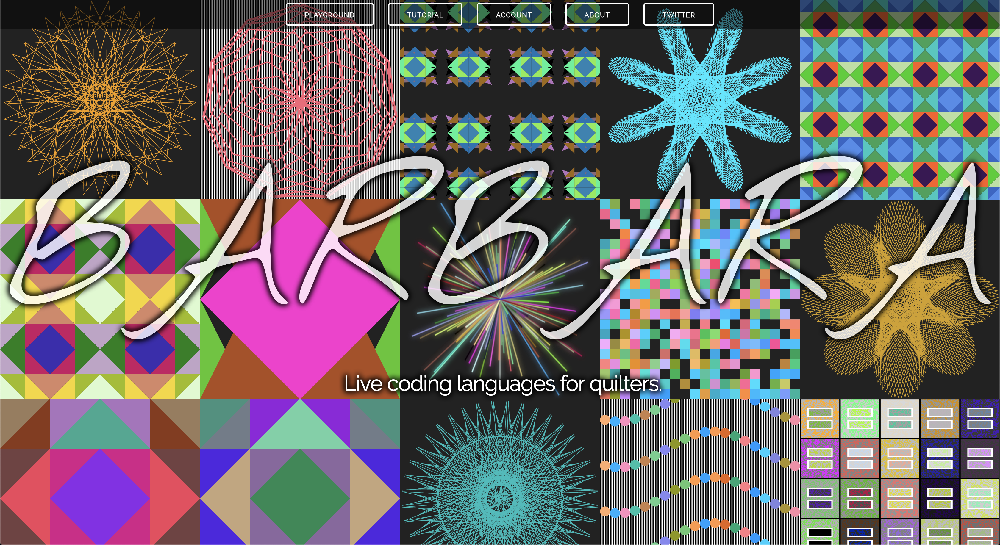
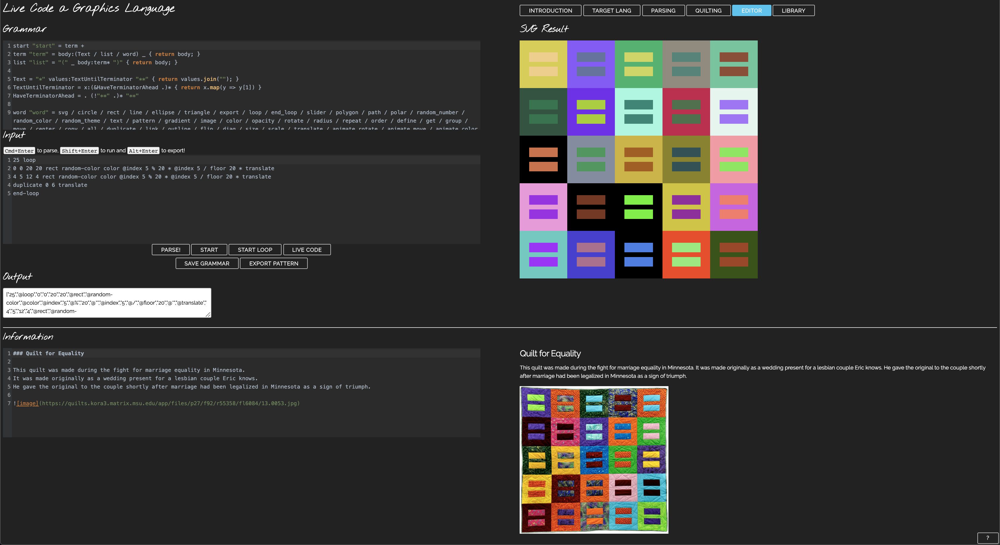

# Barbara

Barbara was created for a WPI Independent Study Project. It is a virtual machine that can be used to create languages for live coding visuals.

Barbara can also be used to digitally recreate quilts.

## Resources

- https://pegjs.org/online
- https://worldmaking.github.io/workshop_nime_2017/
- http://homes.create.aau.dk/dano/nime17/papers/0052/paper0052.pdf

## Repo Structure

- [diary](diary.md) is a "research"/progress diary for ideas and updates on the project that should be expressed in somewhat formal writing rather than TODO comments on code
- [knowledge](knowledge.md) is a "knowledge-base" for referencing definitions and good things to know so we don't have to dig through the diary
- [public](public) directory contains the vm code
- [models](models) directory contains the mongodb model schemas
