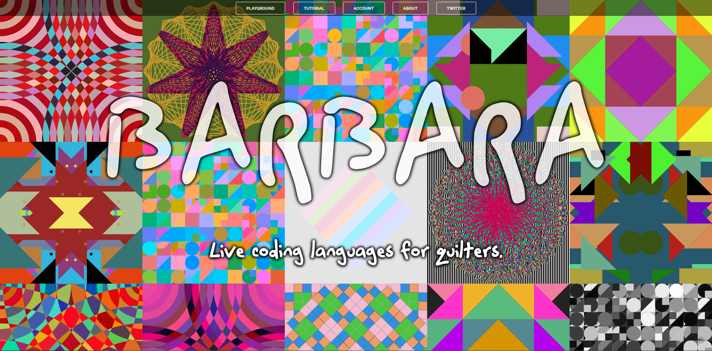

# Barbara

Barbara is a novel live coding interface that enables users to design languages for visual geometric pattern generation. 
Inspired by algorithmic quilting patterns, Barbara helps users construct languages that mimic real-world quilting procedures 
which can be used for both live coding performance or digital quilt recreation. Users create languages and patterns in 
Barbara’s online coding environment with the Parsing Expression Grammar language formalism; the resulting patterns can 
be freely shared, remixed, and combined into new quilts. As a push towards the applications of language-oriented design, 
we created Barbara to broaden access to the power of computational media and the beauty of quilting for both programmers 
and quilters alike. Barbara is free and open-source software.

## Local Development Server

In order to create a local development server, clone this repo. You will need to have a local instance of [MongoDB](https://docs.mongodb.com/manual/administration/install-community/) running. 

Then create a `.env` file in the root folder and add the connection string. If you have named the database barbara, this may look like `MONGODB_URI=mongodb://localhost:27017/barbara`.

## Resources

- https://pegjs.org/online
- https://worldmaking.github.io/workshop_nime_2017/
- http://homes.create.aau.dk/dano/nime17/papers/0052/paper0052.pdf

## Repo Structure

- [diary](diary.md) is a "research"/progress diary for ideas and updates on the project that should be expressed in somewhat formal writing rather than TODO comments on code. **This has been discontinued and replaced with the GitHub Project board.**
- [knowledge](knowledge.md) is a "knowledge-base" for referencing definitions and good things to know so we don't have to dig through the diary
- [public](public) directory contains the vm code
- [models](models) directory contains the mongodb model schemas

## Acknowledgements

Thank you to Charlie Roberts and Gillian Smith for their help and support.
