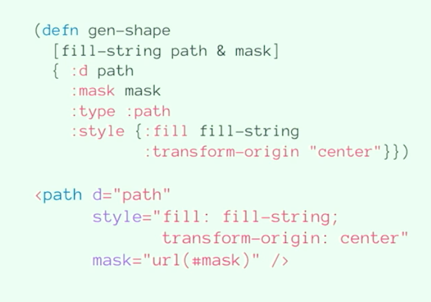

# graphics-virtual-machine
WPI ISP creating a virtual machine for live coding visuals (B-term 2019)


## 10/22/19

- B term begins!
- Set up weekly meetings Tuesday @ 3.00pm (except for first meeting on Thursday @ 3.00pm)
- Created basic html file with grammar, expression, and output textareas using Peg.js
- Looked deeper into [Sarah Groff Hennigh-Palermo - Raving Through the 90s with SVG and Clojurescr](https://www.youtube.com/watch?v=F4pozY_RF5c)
    - The screenshot below is from the video. Example of how her tool uses clojurescript to represents the svg shape. 
    - [la habra repo](https://github.com/sarahgp/la-habra)




- Looked at [svg.js](https://github.com/svgdotjs/svg.js)
    - Might be worthwhile using this to help develop the "target language"
    - Similar to how gibberwocky is used in the NIME workshop
- Or maybe we should use d3.js? (some super neat art below for reference)
    - https://learningd3.com/blog/generative-art/
    - https://bl.ocks.org/philipcdavis/b5224a272556fcb2d0c776b7a247ede4
    - https://bl.ocks.org/philipcdavis/2b626bdef4133921615a5e4fbb921e70
    - https://bl.ocks.org/mbostock/6224050
    
    
VM Process
1. Parse the input to the target language (which is stack-based. e.g. operands then operator)
2. Create a new priority queue (which is a scheduler/player/agent and has it's own queue). Specifically it can contain multiple command queues (type Q), and executes them in an interleaved way.
3. Create a new queue (which is the heap of the PQ). 
4. On each tick, the queue has a todo (queue) and stack. The todo maintains the list of commands in the target language. Pop off the todo, and 
if it's not a string/operator then add the value to the stack, and then eventually execute the command with the stack data.
5. Replace the todo queue if it's a loop
    
#### Questions

- Are we compiling the input to the target language (using peg.js) then interpreting it with the vm. We're parsing it, but a parser is technically part of a compiler.

#### Todo

- Investigate more about good language design (for the target language)
    - Doesn't have to be stack-based
    - Look at SVGs and figure out how to abstract them to best represent them
- Figure out which SVG manipulation tool to use (or develop one)


## 10/8/19

- Looked through NIME workshop source code
- Looked through Peg.js documentation
- Current understanding:
    - I need to create a Target language/instruction set that essentially abstracts SVG functions
    - I need to create a VM that can run this language
    - I need to create an example pegjs grammar of this language
        - the output of the peg.js parse should be in the target language and then run by my vm
    - Most likely going to use Priority Queues for implementation


"A virtual machine (VM) is a software program or operating system that not only exhibits the behavior of a separate computer, but is also capable of performing tasks such as running applications and programs like a separate computer." - [techopedia](https://www.techopedia.com/definition/4805/virtual-machine-vm)

#### Questions & Answers

1. In lect.js, the "VM" is really the Pattern Sequencer, comprised of the cq, PQ, and Q objects/functions? And the instruction set (synonymous to Target language?) is defined in the cases/conditions of the if statements/big switch statement in Q.prototype.step?  (snippet of Q.prototype.step referenced below)

"Hmmmm… it’s Graham’s  code mostly, but from looking at it I’m assuming circular queue, priority queue, and simple queue (maybe you already figured that out). Gibberish handles all the audio stuff, yes, but also the scheduling… basically Graham is creating a function that runs in the audio thread to ensure we can get sample-accurate timing. I would assume you would use another system for timing, most likely based on  requestAnimationFrame.

 Priority Queue is the best data structure FYI." - charlie


2. What is Gibberish's official role in the system's architecture? A helper library for audio output?

"Here’s the timer I use for canvas drawing in gibberwocky if its useful: https://github.com/gibber-cc/gibberwocky/blob/devel/js/animationScheduler.js
most of it is not gibber specific, just a priority queue plus requestAnimationFrame" - charlie

```
case "@dup":
    // duplicate whatever is on the stack
    this.stack.push(
        this.stack[this.stack.length-1]
    );
    break;
    
case "@bpm":
    // set bpm:
    var t1 = this.stack.pop();
    t1 = (t1 == undefined) ? 100 : Math.abs(+t1);
    t1 = (t1 == t1) ? t1 : 100;
    bpm = t1;
    break;
    
case "@wait": 
    // TODO: verify stack top is a valid number...
    // pop wait time off the stack:
    var t1 = this.stack.pop();
    t1 = (t1 == undefined) ? 1 : Math.abs(+t1);
    t1 = (t1 == t1) ? t1 : 0;
    this.t += t1 * this.rate;
    // push back to pq:
    //if (this.pq) this.pq.push(this);
    //console.log("\tq.t =", this.t);
    break;
```

## 10/3/19

- Signed ISP form
- Discussed the livecoding language workshop
- Looking at potentially starting with 2D canvas/SVG virtual machine
